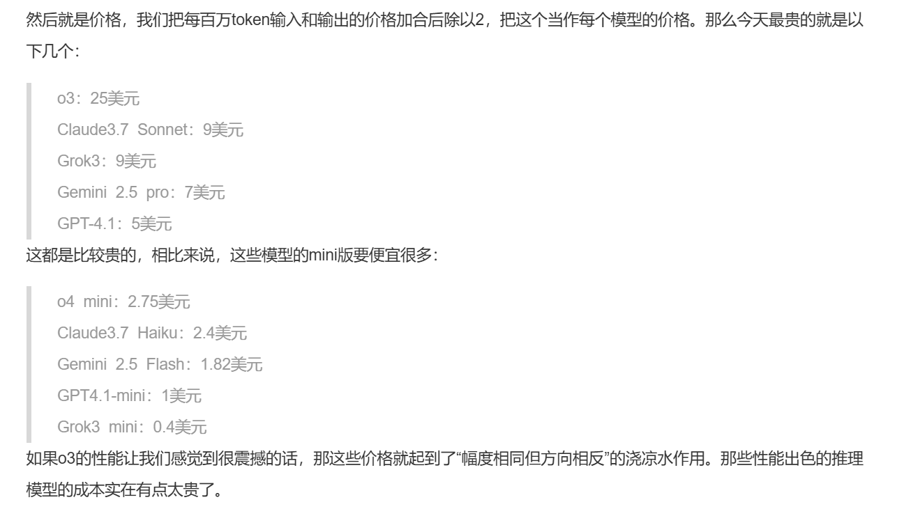
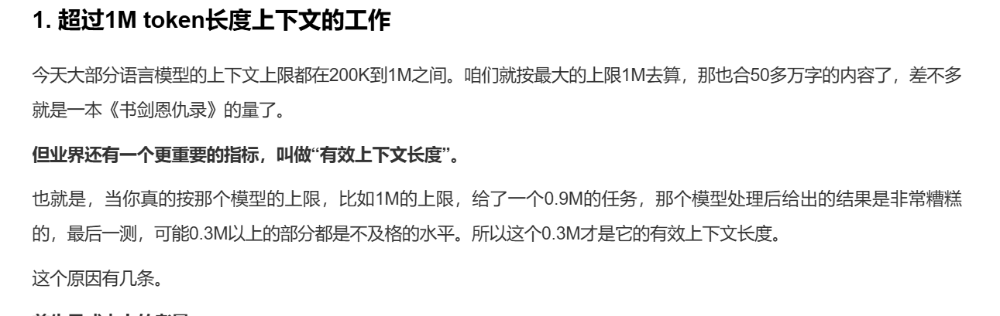

记录一下最近听到的一个特牛逼特震撼的观点

## 一：前置条件

这个观点有两个前置条件，我们先说第一个：

Openai的o3模型在智商测试时测出的IQ为`136` ，而人类平均智商为`90-110`，高出人类平均智商2个标准级，这样的IQ在人群中属于天才，我们类比一下高中的天赋怪，无需多努力就能上清北，大概是这种水平

第二个：

卓克在科技参考4中估算了各大厂商大模型每百万token的成本（约为50-70万汉字），平均在5-10美元。也就是说，大模型每输入输出50-70万汉字，成本仅为70元人民币。上图为卓克的原文

## 二：人类首次给最赖以为豪的智能定价

1. **人首次给最赖以为豪的智能定价**

我们常说IQ越高的人越聪明，IQ就是过往人类社会衡量智能的一种方式，本质上衡量的是智能的高低；而即便大模型的训练成本很高（这是科技公司为了科技垄断所需要承担的成本），普通人使用大模型的成本居然才70块，70块的成本换取大模型的智能，这买卖还不合算？

Think，Mark！想想我们能从上面两个条件推出什么结论？我们能推出一个很震撼的结论——`人类首次给人类最赖以为豪的智能定价`

是的，再重复一遍，**人类首次给我们人类自身最赖以为豪的智能定了价**，而这件事在人类历史上是从没发生过的，过去我们甚至都没有将智能提炼出来过，没有提炼出来自然也就没有为这个专项属性定价的资格，而今天，我们正在做从没有人做过的事

2. **这引发了什么问题**

那么随之而来出现的一个问题是：`与人类比肩的智能远远没有我们预想中那么值钱`。一个天才的定价才70块？开玩笑呢吧。我们假设一个大学毕业生的薪资为7000一个月，这7000的工资里包含了智能部分和非智能部分。在信息时代，老板雇用员工完成脑力活动的工作，他真正想要的是你提供的智能价值，也就是老板主要是为你能提供的智能价值付费，你7000的工资大部分来源于智能的那一部分。但现在AI跳出来，声称智能部分只能定价70块，那剩下的6930是在为什么付费？这6930粗略上可以看为，是在为人的个体活在世上的刚性成本付费。怎么理解这句话？老板付这6930是为了让你正常的活着以便能来公司用AI的智能创造给他创造价值

我们一直以来接受的教育并没有让我们的智能变得值钱，而是把我们包装得更好看。你读了大学读了研究生，你的智能的价值就能从70块翻倍成140块了？你的IQ就能从90变为180了？不见得吧。那为什么所有人读完书之后，都觉得自己应该拿更高的工资，985就应该拿比双非多1.5倍的工资，比二本多2倍的工资？这说明了一点，我们的教育其实就是让我们自洽的认为，**除去真正意义上智能价值以外的，我们的包装才是真正有价值的东西**

但在这个时代，我们每个人都不能否认，大模型是会越来越聪明的，一个人除去智能价值以外的那层包装的价值将迟早被越来越多人戳破，人们将会专注于真正的智能价值。

哇，大模型那么聪明，普通人的智能是什么货色啊，我是老板的话，我有什么理由为了用这种货色支付30倍乃至100倍的成本？这不纯冤大头吗。

那是不是意味着未来的老板不需要员工了？我觉得我们不应该这样看待，我们应该从另一个角度看——`员工不再需要老板了` 。但凡你去工作，老板都要为你身为人类的那层外包装付额外的成本，这就是纯纯冤大头，那么谁又愿意当冤大头？未来的人戳破了人类的包装价值后，是没有人愿意为这层包装付额外的成本的，也没有人会愿意为别人存在于这个世界上应有的刚性成本支付任何溢价，而当你只为自己承担你自己存在于世上的刚性成本时，你不就成了自己的老板吗？因此，`并不是老板不需要员工了，而是员工不需要老板了`

## 三：我们应该怎么看待

既然我们都公认，大模型只会变得越来越聪明，其智能将越来越超越人类，连我们最赖以为豪的智能都被大模型压了一头，那我们的价值存在哪里？

有一个很简洁的公式说明了这一点：

> `价值=智能价值+超越智能的价值`

以前的人不清楚什么是智能价值，没有人给智能定过价，所以价值的计算公式往往是一笔糊涂账，压根算不明白，里面掺了很多水分

什么是超越智能的价值？卓克的一篇文章探讨了大模型还取代不了的工作有哪些，他的观点也很新颖

他说的第一点是：`超过1M token长度上下文的工作`

前面也提到过了，百万token的成本在35-70人民币之间，而一百万的token，内存上刚好是1M。也就是说，AI暂时还替代不了超过50-70万汉字长度的上下文的工作。而且更重要的一点是，其实很多大模型厂商都宣称自己的模型的有效上下文长度为1M，但实际上大多数都做不到，我们平时自己使用大模型的时候也有这种感觉——对话进行的越长，大模型越胡言乱语。而大部分大模型的有效上下文长度最多也只有0.3M。而为什么对话长度不能超过1M？这受限于大模型的底层逻辑，支持的上下文长度越高，所需要的算力成本是指数增加的，最后的成本是当前生产力水平难以承担的

大模型还取代不了的工作是什么？那就是`利用互联网上没有的知识开展的工作`

以GPT4来说，其训练数据为1PB(1024²GB)，这1PB还是清洗后的数据量，且包含各个知识领域。但是有很多信息是不在互联网上的，卓克举的例子很高大上，他以摩根大通这样的金融公司为例，一家公司就有150PB的数据，这是沉淀了几十年，各分析师精加工后仅在公司内部使用的宝贵数据。

我们不谈大亨，只专注于普通人。`大模型无法使用脱离互联网之外的内容的，而如果我的工作是我使用AI，基于我个人内部长期沉淀的东西才能完成的，那么这份工作在世界上是独一份的，这就是人保留自身价值的核心基本盘`
