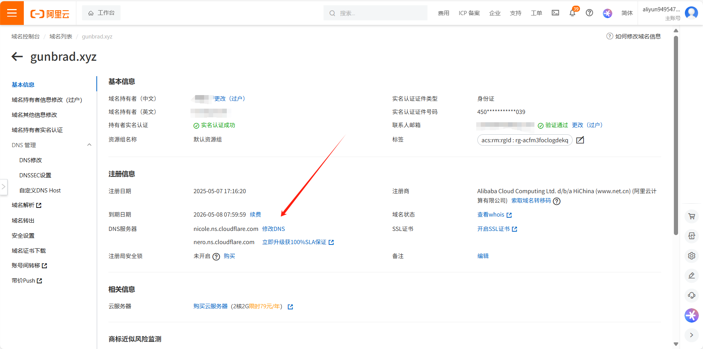

# 

## **一：下载cursor-free-vip**

cursor的免费版可以发起50次对话，使用完50次之后在官网注销账号重新注册登录就能重获50次对话额度，但是重新注册3次后就不能通过该方式白嫖50次cursor了。第一是cursor官方会锁定你电脑上的机器码，免费版的同一个机器码最多发起150次对话。第二会关联你的邮箱，同一个邮箱只能反复注册3次。

为了解决这个问题，我们需要一个工具[cursor-free-vip](https:/github.com/yeongpin/cursor-free-vip)

找到`Releases`，点击进入

下载与你操作系统适配的一项

安装后运行（需要管理员权限，点击确认即可），出现如下界面就说明成功了：

## 二：注册域名并托管到cloudflare

1. 首先你应该注册一个[Cloudflare](https://www.cloudflare.com/zh-cn/)账号，QQ邮箱和谷歌都可

2. 点击左侧导航栏的`账户主页`，选择`添加域`

3. 现在我们需要到[阿里云](https://www.aliyun.com/)购买一个域名（也可以使用免费域名，不过我没试过），输入你想要查询的域名，点击`立即查询`。我使用的是.xyz域名，首年6块，非常实惠

4. 首次注册域名需要实名认证，填写信息模板（信息模板的审核需要时间，耐心等待一会就好了）。之后按指引支付即可

5. 回到cloudflare，填写刚才注册的域名，会给我们两个专属DNS服务器地址，我们需要到阿里云配置DNS服务器

在阿里云的域名列表找到刚注册的域名，点击`管理`

点击`修改DNS`

点击`修改DNS服务器`，修改完后点击`同步`

## 三：配置电子邮件路由

完成修改DNS服务器后，需要一定时间生效(大概五六分钟？)，期间cloudflare中你的域名会显示为`名称服务器无效`，这是正常的。当生效后会显示`活动`。接下来可以自定义邮箱了

1. 在cloudflare中进入你自己注册的域名，在左侧导航栏选择`电子邮件`->`电子邮件路由`，然后点击`目标地址`，选择`添加目标地址`，在其中填写你实际接受邮件的邮箱即可，这样只要向你的自定义邮箱发送邮件，邮件会自动转发到你填写的目标邮箱中。你会在目标邮箱收到一封验证邮件，验证成功后就完成了目标地址的创建

2. 接下来选择`路由规则`，选择`创建地址`，自定义地址填写你的自定义邮箱名，填单个数字也可以；目标位置填写你在上一步验证的目标地址

## 四：完成cursor注册

1. 打开第一步下载的cursor-free-vip文件，输入3`关闭cursor应用`（如果你打开着cursor就先输入3，否则不用管这一步），然后输入8`完全重置cursor`，接着输入2`使用自定义邮箱注册cursor`。把你刚创建的自定义邮箱填进去，该程序会自动打开Chrome完成 cursor的注册，非常方便

2. 如果通过上一步不能完成cursor的注册，自动打开Chrome后什么也没有发生/程序卡住/程序卡在验证环节，那还是手动完成cursor的注册吧。我们打开[Cursor](https://www.cursor.com/cn)的官网，点击`登录`，选择`Sign up`，进入注册页面。信息随便填，也可以填写cursor-free-vip随机生成的姓名和密码，邮箱填写创建的自定义邮箱即可。（但是还是要先完全重置cursor再手动注册）

好的，学到这，你已经是合格的嫖客了，开始爽用cursor吧
