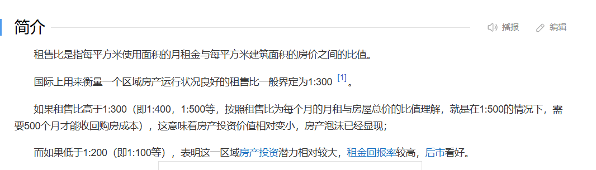
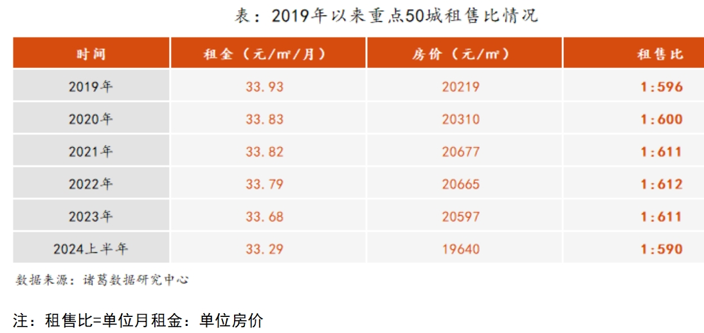
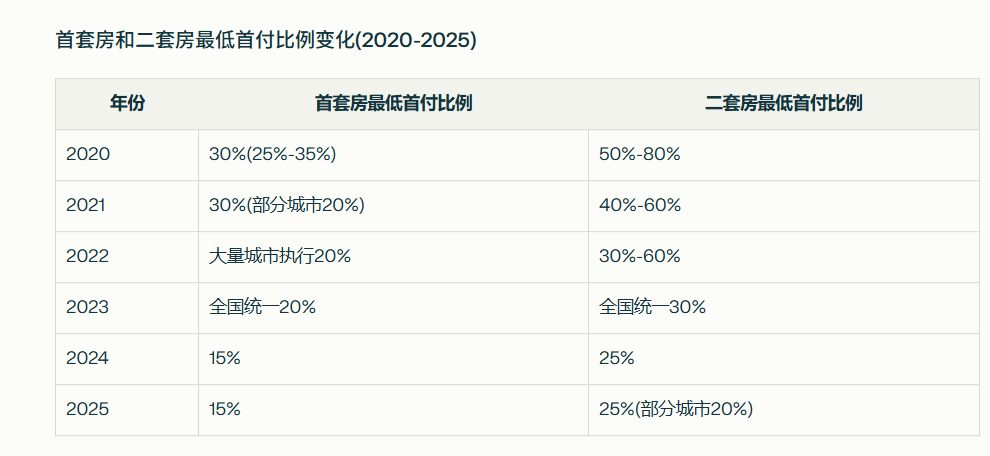
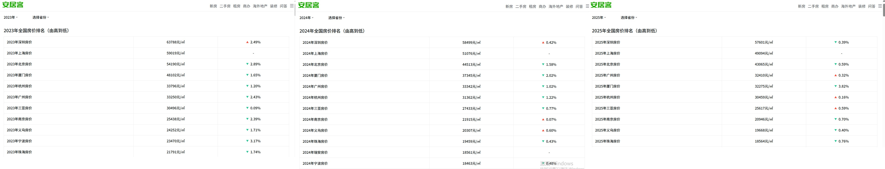

记录一个关于买房的观点

# 一：前置知识

在开始前需要了解的概念：

1. **杠杆**
   
   杠杆交易就是利用小额的资金来进行数倍于原始金额的投资。
   
   以买股票为例，假如你有10万元本金，想买50万元的股票。正常情况下你买不起，但通过5倍杠杆，平台可以借给你40万元，这样你就能用50万元去炒股了。所以也可以说杠杆就是借钱/贷款嘛，借了多少倍的本金就加了多少倍杠杆
   
   假设股票涨了20%，那你就赚了10万元，除去借来的钱，你的资产增长到了20万；而如果你不使用杠杆，你只能赚2万，实际资产也才12万。
   
   而股票跌了20%，那你就亏了10万元，底裤赔光！本金全亏没了；而不使用杠杆，你只会亏2万元
   
   能够用少量资金撬动大资金投资，这就是杠杆

2. **爆仓**
   
   什么是爆仓呢？爆仓就是，当你的保证金因行情变化而不够时，交易所为了避免亏本，就会强制卖掉你持有的金融产品
   
   保证金是什么？你一开始通过多少本金开的杠杆，你的保证金就是多少
   
   以买比特币为例，假设当前比特币价格为100万美元，你有100美元，现在你打算开100倍杠杆买比特币，那么当比特币下跌了1%，也就是99万美元时，你就爆仓了，会被强制卖掉你所持有的比特币
   
   为什么呢？因为实际上比特币下跌了1万元，这1万元里有你的保证金100，有你向交易所借来的9900。由于交易所不会干赔本买卖，因此在你亏掉你的保证金之后，交易所就会强制卖出你持有的比特币，将本属于交易所的资产收回。
   
   这里面有一个计算公式：`容错率=1/杠杆倍数`，我开100倍杠杆，我的容错率就是1%，当股票/比特币下跌了1%我就爆仓了，如果我开10倍杠杆，我的容错率就是10%，只有下跌10%时我才会爆仓
   
   于是另一个很有趣的现象出现了：`为了避免爆仓，人们只好继续往交易所里投入更多本金。`
   
   假如你在临近爆仓前继续投入100美元的本金，那么此时你的本金就变成200美金了，原来的100倍杠杆就变成50倍杠杆了，你可以容忍行情下降到2%了！此时就避免了爆仓。
   
   但我们也知道，投机市场里也有少数孤注一掷，all in的人。如果一个把自己全部储蓄梭哈all in的人面临爆仓，那他会怎么办？继续借呗——只要不爆仓，我就有希望翻盘！只要我还持有币，我就还能赚回来！向银行借，向亲戚借，而做到这种地步最后却没拿到结果的，往往上天台了

3. **租售比**
   
   租售比的定义是：**房屋租金与房售价的比值**
   
   举个例子，我有一套700万的房，我月租金是1w，也就是说我的租售比为1:700
   这也能反应一套房需要租多少个月才能收回原来买房的房款，以1:700来说，一共需要700个月，约58年才能收回房款
   
   国际标准通常为1:200 - 1:300，但根据统计，我国的租售比远低于国际标准。
   
   下图还有一张统计重点50成的租售比的图标，且该租售比是平均值，在城市较为核心的地段，租售比可达1:760
   
   
   
   

# 二：炒股炒币跟买房，到底谁更赌？

从2024年开始，我们买房的首付已经降低到了15%，我们只需要花15%的钱，就能住上跟100%的钱等值的房子，剩余的85%贷款慢慢还呗，还20年30年，每个月从月薪中抽出还房贷的部分。这里面的杠杆倍数是多少，相当于6倍杠杆吧，我只有15%是我自己的能力，却有6倍以上是超过自己的能力，这不就是开了6倍杠杆吗？而根据我们的容错率计算公式，我开6倍杠杆的容错率为16.7%，也就是说，当房价下跌16.7%的时候，我就爆仓了

从这个角度解释买房，感觉很新奇吧？我们再从另一个角度看，在金融市场里，肯定也有人加杠杆炒股炒币，但一个正常人，没有疯掉的人，是不会把自己所有钱都投进去加杠杆的，一个正常人会怎么投资？

比如说我有十万，我最多拿10%，也就是1万作为投资账户。这1万的投资账户，我只拿5%，也就是500来玩杠杆。这样即使我开的是100倍杠杆，那么对于整体的1万投资账户来说，我的杠杆倍数是100*5%=5倍，因为我不是用我整体的投资账户来承担风险，而是用5%的投资账户来承担杠杆的风险。而我的投资账户只是我总资产的10%，因此对于我的总资产来说，我的真实杠杆倍数才`0.5`。再假设我活一辈子，我能积累下的全部资金为100万，把目光放眼我的整个人生来说，我现阶段积累的10万跟我整个人生能积累下的100万相比，我的杠杆倍数才`0.05`，这风险相当小了吧？

我们再反过来看买房。我们买房的本金是从只占总资产十分之一的投资账户里出的吗？还是说从占我总资产几分之几的买房账户里出？完全不是吧，买房的本金好像是基于掏空你一整个为核心的，基本上你一付首付，就必须把自己前半生大部分积蓄都花出去，你仔细想想，你在二三十岁这个年龄付首付的钱占你人生总资产的几分之几？对于一个普通人来说，如果他付首付的钱全是自己攒的，并且只占他当前资产的50%，那么已经很牛逼了好吧。这样说可能没什么概念，我们引入具体的数据，比如说广州一套100m²房，全款至少350万，首付52.5万，开6倍杠杆贷款30年还297.5万，按照我们的算法，你在二三十岁这个年龄攒下了105万，首付52.5万已经很牛逼了，而实际情况是大部分人几乎都是所有存款梭哈买房的。再假设你整个人生的总资产是你买房时的两倍，也就是210万，那么你买房的实际杠杆倍数是**3倍**，这是什么概念？`这3倍的杠杆不是加在你的投资账户上的，是加在你的人生上的，如果房价下跌33.3%，那你的人生就爆仓了，不是你的投资账户爆仓，是你的整个人生爆仓了。`

这就很有意思了，我们可以对比一下正常人投资的杠杆和买房的杠杆，`投资的杠杆对于整个人生来说才0.05，而买房的杠杆对于整个人生来说居然是3，两者的赌性成分相差了60倍！` 但是有一个很有意思的现象：**我们平时在生活中接触到的各种信息，都在说炒股的人有赌性，混币圈的人更是赌狗，赌得上头了没救了，但从来没有人说买房的人是赌狗。从来没有过**

**炒股炒币和买房两种选择之间的赌性相差了60倍，但却是赌性更小的那一批人，被社会认为是普遍意义上的赌狗；而赌性更大的买房，却被认为是正常的，更是被认为是每个年轻人都必须要做的。** 如果这是正常的话，那人们就应该反过来觉得炒币的人把每个月的工资固定比例投进投资账户里是正常的，就不应该骂他们是赌狗，因为两者本质都是加杠杆。但实际上，炒币的人一般不会这样做，但买房的人却这样做，那么到底是谁在赌呢？

如果你认同这个观点的话，那你再想想，大部分人的思维模式是不是普遍被塑造的？大部分人的判断标准也是被社会塑造的？**我们的判断标准被塑造成认为什么是对什么是错，什么有价值什么没价值**。关于买房和炒股炒币，我们甚至认为炒股炒币赌性更小的人是赌狗，却认为买房这一赌性更大的事是极为正常且必须要做的事，这就很恐怖了。因为社会舆论是可以引导的，能被引导就能被控制，你的思维是可以被上层建筑灌输和塑造的。这个观点就不再延伸了。

这里有一个前提是：**房子是金融资产**。但凡房子是个金融资产，它就应该纳入金融资产的考虑范围内。为什么这么说？难道房子不是买来住的吗？它怎么能是金融资产呢？我们想想，房子的价值在哪？房子肯定有建筑成本吧，也肯定有使用价值吧，建筑成本加上使用价值衡量的是人们心中这套房子真实且合理的价值。如果光看它的使用价值，房子只是买来自己住的，那它的标价合理吗？**普通人付个首付就得掏空一家人的钱包，并且未来二三十年基本存不下来什么钱，就说明了它的标价已经完完全全高到了不合理的地步**。那么既然房价明显地高出了它应有价值一大截，高出的这一大截在哪？高就高在房子具有金融资产的属性——资产本身是可以交易的，房子是能够将其使用价值租赁出去的，高出的这一大截都是炒起来的

再举一个例子说明房价很贵。如果我买房是为房子的使用价值付费的话，那我租房不也是为它的使用价值付费？那有没有发现一个事实——**按照我国房屋平均租售比1:600来说，我租一个房子租50年的租金总额，才刚好够买一套房，而这50年的租金仅仅只是我用于支付这套房的使用价值的**。我们可以想一想，一套房的使用价值真的跟50年的房租等价吗？如果我真有350万买一套广州平均水平的100m²的房并且将其使用价值租售出去的话，哪怕我把这350万存余额宝里，我一年都能拿到7万的利息，即使每个月付5000房租，我一年也能剩下1万。我们会发现，房子这个金融资产，它在今天所产生现金流的效益甚至比余额宝还低，这不是典型的房价高的信号吗

即使你跟我说，你买房就是买来自己住，你不出租，所以你买的房不具有金融资产的属性。但房子的使用价值和它的金融属性都是它固有的，你不能分开付费，假设一套房的使用价值才50万，而它的金融属性有250万，但你在支付房款时，即使你一开始压根不打算租赁出去，**但你仍不得不为除去使用价值外的金融属性支付额外的溢价**，你不能说你只为它的使用价值付费，拿买比特币做例子吧，目前比特币78.7万美元一个，但你仍然可以买0.00001个比特币。但你能买0.00001个房子吗？你能只为房子的使用价值付费，不为它的金融属性付费吗？不行啊，你买房子只能买一套，你钱不够多只能上杠杆买整套，你不得不为它的金融属性支付额外的溢价

在我小学还是初中的时候，人们特别热衷于炒房，我作为学生，甚至在课外读物上看到了炒房风气之盛，以至于政府下场控制房价的资讯。当时的人们认为买房是一种致富手段，房价不跌，买了我可以等它涨高了，反手卖出去；也可以低价买入一直租赁出去。因此掀起了炒房热，此时人们更关注房子的金融属性。因为人们觉得房子未来可以存储更多价值，持有房子以后会让我赚钱，我愿意买它，我花了这个代价之后，这个东西能让我在未来赚到更多的钱，人们主要为它作为金融资产的属性付费。但现阶段买房致富的预期已经不太成立了，看下面的对比图，很多地方的房价已经跌了20%，甚至发达城市中环境好，地段好的房子的房价下跌了30%以上。在金融领域里，我看一只股票跌，那我就不应该继续大量买入，那么为什么仍然有人买呢？**因为炒房的人和买房居住的人是两批人**，炒房热的时候，人们把房子的金融属性的价值炒得太高了，而买房居住的人年年都有——房子牵扯太多东西了：男性到了年龄就被要求必须有车有房，不然你就是相亲市场里的低质男性，找不到配偶；户口落户，孩子读书，医疗资源等等，你不买套房，你就没有这些资格，很多城市里应有的福利和权利都不属于你，这也是跟房子捆绑在一块的。

那么房子作为金融资产，为什么不会爆仓呢？按理来说，我上6倍杠杆，且这是人生级别的真实杠杆，波动16.7%就爆仓了，近年的房价更是跌了20%左右，可我们从没听过房市爆仓，国家为什么不会在房价下跌16.7%后把房子收走呢？是因为你买房签的协议里，就已经为未来二三十年做下决定了——你每个月可是要还房贷呢，按照之前的说法，差不多爆仓时，要怎么做才能暂时避免爆仓？继续投入更多本金呗，你每个月的工资拿来还房贷的部分，就是用来补齐你亏掉的本金，所以才不至于爆仓，把你的房子收回。

这个观点我觉得确实很新颖很有价值，值得记录下来，它让我在未来七年内面临是否买房这一问题时，会从这个角度重新思考这个问题。并且分享我这个观点的人初步判断，**在整个的经济结构和中国的主要生产力形势发生变化之前，他个人觉得房价还是会倾向于回归自己真实的建筑成本加使用价值**。等我过几年真正面临这个问题时，再回头看这句话，验证是否说对了。
