# 

记录一下我是如何搭建我的个人博客的

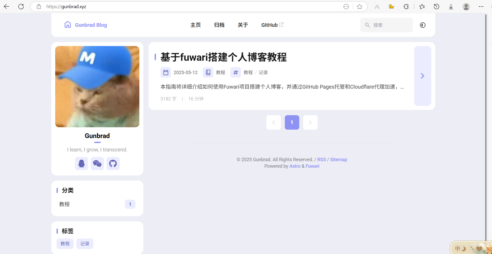

## 目录

- [前置准备](#前置准备)
- [一：获取Fuwari框架并完成配置](#获取Fuwari框架并完成配置)
- [二：文章编写](#二文章编写)
- [三：部署到GitHub](#三部署到github)
- [四：配置Cloudflare Pages](#四配置cloudflare-pages)
- [五：设置自定义域名](#五设置自定义域名)

## 前置准备

开始搭建博客前，需要做好如下准备，安装将不再赘述：

1. **开发环境**：
   
   - [Node.js](https://nodejs.org/) >18.x ,<= 22
   - [Git](https://git-scm.com/)

2. **账号**：
   
   - [GitHub](https://github.com/) 账号（用于代码托管）
   - [Cloudflare](https://www.cloudflare.com/) 账号（用于网站托管和域名管理）

3. **可选**：
   
   - 自己的域名（如果使用自定义域名）

## 一：获取Fuwari框架并完成配置

### 1.1 获取Fuwari框架

**Fork仓库**

1. 访问 [Fuwari GitHub仓库](https://github.com/saicaca/fuwari)

2. 点击右上角的"Fork"按钮
   
   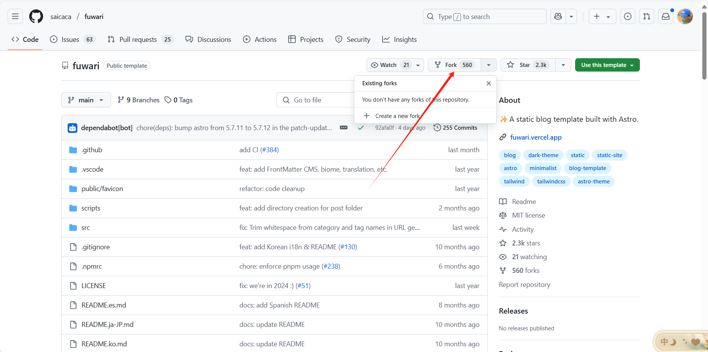

3. 设置仓库名称，然后点击"Create fork"
   
   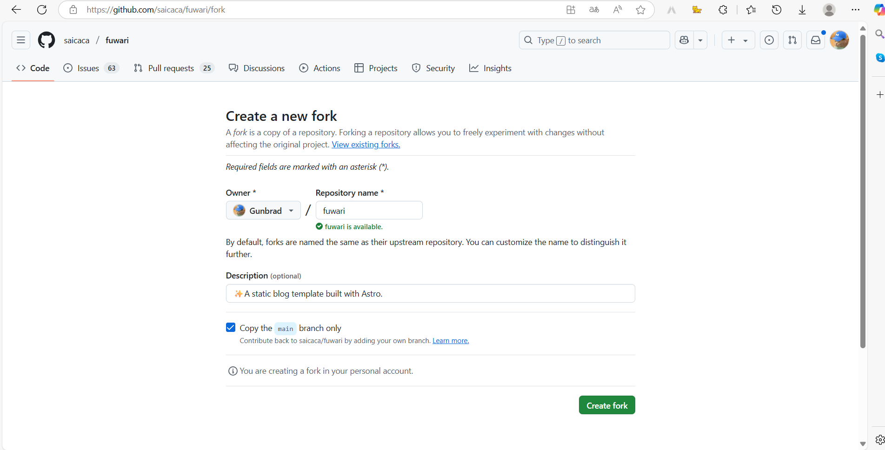

### 1.2 将仓库克隆到本地

1. 新建文件夹，在标识处输入cmd
   
   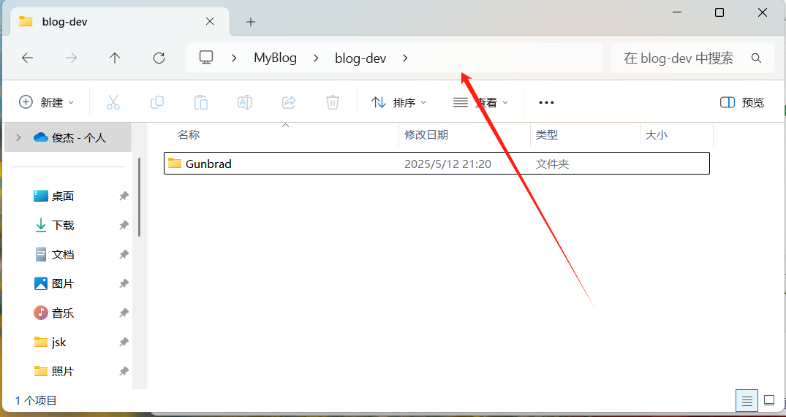

2. 打开终端（命令行），执行以下命令：

`git clone https://github.com/YOUR_USERNAME/REPO_NAME.git`

替换 YOUR_USERNAME 为自己的GitHub用户名，REPO_NAME 为仓库名称

### 1.3 安装依赖

1. 在项目根目录安装pnpm：`npm install -g pnpm`

2. 然后安装项目依赖：`pnpm install`和`pnpm add sharp`

### 1.4 基础配置修改

打开`src/config.ts`文件，这个文件博客相关的配置：

网站配置：

```typescript
export const siteConfig: SiteConfig = {
    title: "Gunbrad Blog", // 博客名称
    subtitle: "",
    lang: "zh_CN", // 博客语言，选择zh_CN即为中文
    themeColor: {
        hue: 280, // 博客的颜色主题
        fixed: true, // 设为true游客不能自主调整博客颜色主题
    },
    banner: {
        enable: false, // 是否开启banner图
        src: "assets/images/banner5.jpg", // banner的路径，放在assets/images目录下
        position: "bottom", // Equivalent to object-position, only supports 'top', 'center', 'bottom'. 'center' by default
        credit: {
            enable: false, // Display the credit text of the banner image
            text: "", // Credit text to be displayed
            url: "", // (Optional) URL link to the original artwork or artist's page
        },
    },
    toc: {
        enable: true, // Display the table of contents on the right side of the post
        depth: 2, // Maximum heading depth to show in the table, from 1 to 3
    },
    favicon: [
        // Leave this array empty to use the default favicon
        // {
        //   src: '/favicon/icon.png',    // Path of the favicon, relative to the /public directory
        //   theme: 'light',              // (Optional) Either 'light' or 'dark', set only if you have different favicons for light and dark mode
        //   sizes: '32x32',              // (Optional) Size of the favicon, set only if you have favicons of different sizes
        // }
    ],
};
```

个人资料配置：

```typescript
export const profileConfig: ProfileConfig = {
  avatar: "assets/images/avatar.jpg", // 头像路径，建议放在src/assets/images目录下
  name: "你的名字", // 你的名字
  bio: "个人简介", // 你的个人简介
  links: [
        {
            name: "QQ",
            icon: "fa6-brands:qq", // 在icons.js这个网站寻找对应的图标，fa6-brands系列的图标就足够了
            url: "https://qm.qq.com/q/iejWCmdg2c", // 手机QQ的“我的二维码”界面的分享功能可以复制链接，粘贴在此处即可
        },
         {
            name: "Wechat",
            icon: "fa6-brands:weixin", // 我在前端编写了代码，悬停时可显示出微信的二维码
            url: "",
        },
        {
            name: "GitHub",
            icon: "fa6-brands:github",
            url: "https://github.com/Gunbrad", // url表示目标链接，点击即跳转
        },
    ],

};
```

顶部导航栏配置：

```typescript
export const navBarConfig: NavBarConfig = {
    links: [
        LinkPreset.Home,
        LinkPreset.Archive,
        LinkPreset.About,
        {
            name: "GitHub",
            url: "https://github.com/saicaca/fuwari", 
            external: true, 
        },
    ],
};
```

## 二：文章编写

经过以上的步骤，你已经完成了博客的配置，现在开始编写文章吧

### 2.1 启动开发服务器

在项目根目录的cmd界面输入这个命令启动本地开发服务器：

```bash
pnpm dev
```

现在我们可以在浏览器中访问`http://localhost:4321`查看博客了。

### 2.2 创建新文章

在项目根目录的cmd界面使用内置命令创建新文章：

```bash
pnpm new-post 文章标题
```

这将在`src/content/posts/`目录下创建一个新的md文件，编写文章就是在这个md文件中进行的

### 2.3 编辑文章

打开新创建的md文件，会有如下的配置信息：

```yaml
---
title: My First Blog Post // 文章标题
published: 2025-05-12 // 文章创建时间
description: This is the first post of my new Astro blog. // 文章描述，会显示在文章标题下面
image: ./assets/images/cover.jpg // 文章封面，填写相对路径
tags: [Foo, Bar] // 文章的标签
category: Front-end  // 文章分类
draft: false // 是否为草稿
---
```

在配置信息下方就是我们编写博客内容的地方

### 2.4 本地预览

完成编写并保存md文件后，本地服务器会动态更新，我们可以在本地开发服务器中实时预览到刚编写的博客。

### 2.5 md编辑器推荐

- 教我做博客的大佬推荐了一款md编辑器——`MarkText`,使用该编辑器可以直接Ctrl+C/V完成图片的粘贴

- 依次点击：MarkText软件的左上角的三条杠 -> File -> Perferences -> 左侧的Image分类 -> 如图设置 -> 注意更改第一个选项为Copy开头的选项，该选项允许我们置入图片时，会往选定的文件夹复制一份。

- 将Perfer开关打开，然后上下两个文本框一个填写绝对路径一个填写相对路径。绝对路径和相对路径都填写我们博客中assets/images的目录
  
  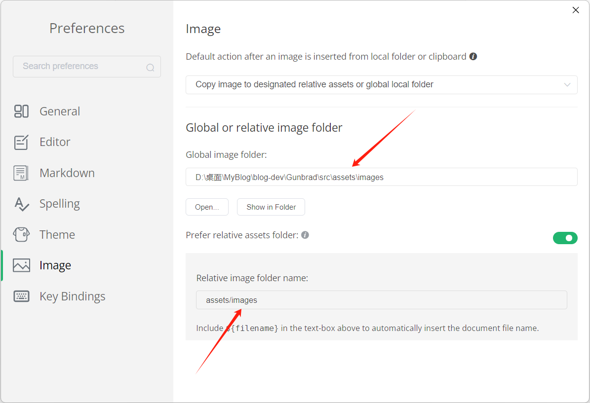

## 三：部署到GitHub

我们已经完成了博客的编写，接下来就应该部署到github上了

### 3.1 配置git信息

1. 首先，在根目录的cmd界面运行以下配置指令：

```bash
git config --global user.name "你的Github用户名"
git config --global user.email "你的Github邮箱@example.com"
```

该配置指令让git知道你是谁

2. 然后在windows的终端配置SSH公钥

```bash
// 输入这串指令生成SSH公钥，填写自己的邮箱，之后一路回车即可
ssh-keygen -t ed25519 -C "your_email@example.com"
// 输入这串指令查看SSH公钥，~填写.ssh之前的路径，然后复制生成的密钥
cat ~/.ssh/id_ed25519.pub
```

3. 接着在添加公钥到 GitHub
- 登录 GitHub，点击右上角头像 → **Settings** → **SSH and GPG Keys**。

- 点击 **New SSH Key**。

- 填写：
  
  - **Title**: 自定义名称，随便填写。
  
  - **Key Type**: 保持默认 `Authentication Key`。
  
  - **Key**: 粘贴复制的公钥内容（以 `ssh-ed25519` 开头）。
4. 现在我们配置好了SSH公钥，就需要在项目根目录下运行cmd，将远程仓库更改为ssh*

```bash
git remote set-url origin git@github.com:xxx/xxx // 替换为下图地址
```

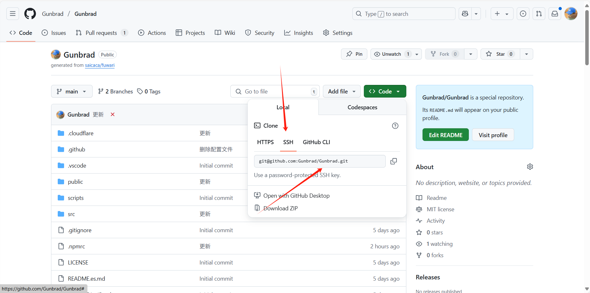

5. 将更改推送到GitHub仓库：

```bash
git push origin main
```

## 四：配置Cloudflare Pages

根据以上的步骤，我们已经将项目上传到了github上，现在就需要让Cloudflare连接上Github，使用Pages服务展示我们的博客了

### 4.1 设置pnpm-lock.yaml与package.json同步

我在构建时遇到了依赖问题，为了避免该问题，要确保`pnpm-lock.yaml`与`package.json`同步。在项目根目录创建或修改`.npmrc`文件：

```
manage-package-manager-versions = true
frozen-lockfile = false
```

### 4.2 创建Cloudflare Pages配置文件

在项目根目录创建以下文件，以配置Cloudflare Pages的构建和路由：

**1. 创建`public/_redirects`文件**

```
# 这个文件是为了让Cloudflare Pages识别这是一个静态网站项目
/* /index.html 200
```

**2. 创建`public/_headers`文件**

```
/*
  X-Frame-Options: DENY
  X-Content-Type-Options: nosniff
  X-XSS-Protection: 1; mode=block

# 静态资源缓存
/assets/*
  Cache-Control: public, max-age=31536000, immutable
```

**3. 创建`.cloudflare/pages-config.json`文件**

```json
{
  "build": {
    "command": "pnpm install --no-frozen-lockfile && pnpm run build",
    "output_directory": "dist"
  }
}
```

### 4.3 在Cloudflare Pages中创建项目

1. 登录[Cloudflare Dashboard](https://dash.cloudflare.com/)

2. 在左侧菜单中选择`"Workers 和 Pages"`
   
   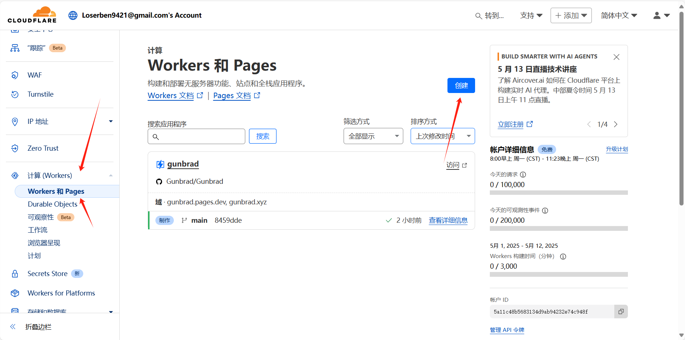

3. 点击`"创建"`后点击`"Pages"`

4. 选择`"导入现有git存储库"`
   
   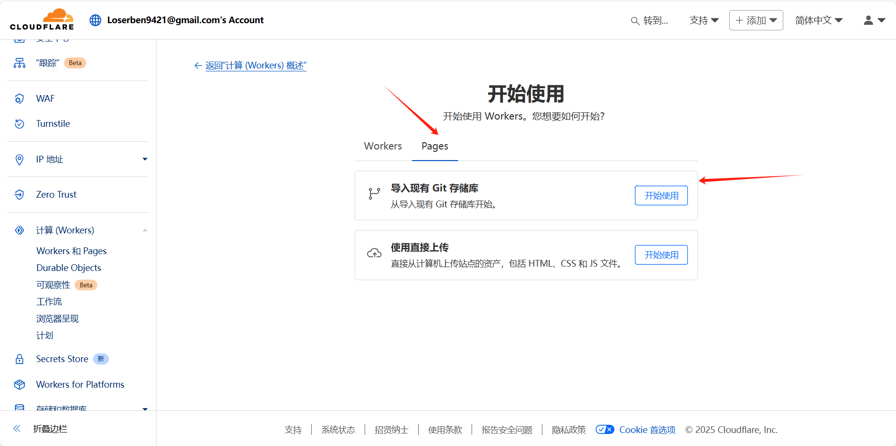

5. 选择GitHub作为Git提供商

6. 授权Cloudflare访问我们的的博客仓库，然后点击`“开始设置”`
   
   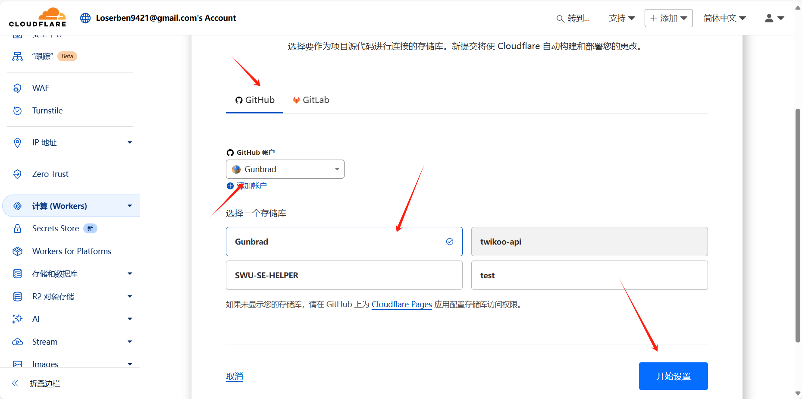

7. 在基本配置中：
   
   - 项目名称：自定义项目名称，填你的博客名即可
   
   - 生产分支：`main`
   
   - 构建设置：
     
     - 构建命令：`pnpm install --no-frozen-lockfile && pnpm run build`
     
     - 构建输出目录：`dist`
       
       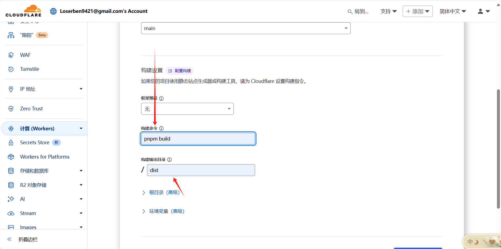

8. 点击"保存并部署"

Cloudflare将开始构建和部署我们的博客。部署完成后，我们会获得一个`*.pages.dev`的网址。

## 五：设置自定义域名（如果你有自己的域名）

### 5.1 添加自定义域名

1. 在左侧菜单中，`"Workers 和 Pages"`，点击我们刚创建的pages
   
   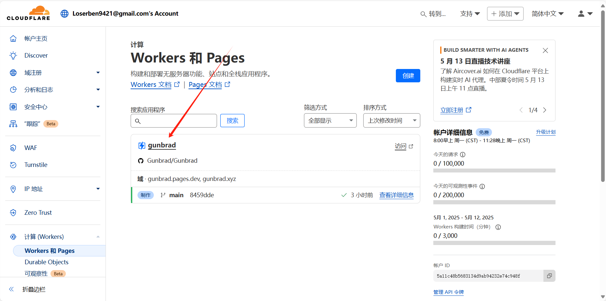

2. 点击`"自定义域"`，然后选择`“设置自定义域”`
   
   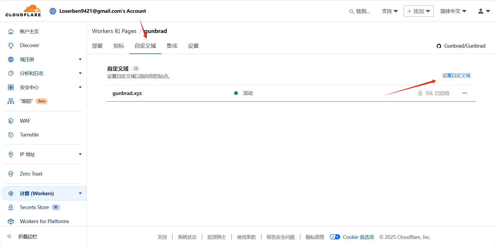

3. 输入你有的域名

4. 选择DNS记录类型（通常为CNAME）

5. 点击"继续"
   
   之后我们就能访问自定义域名来访问我们的博客了！
